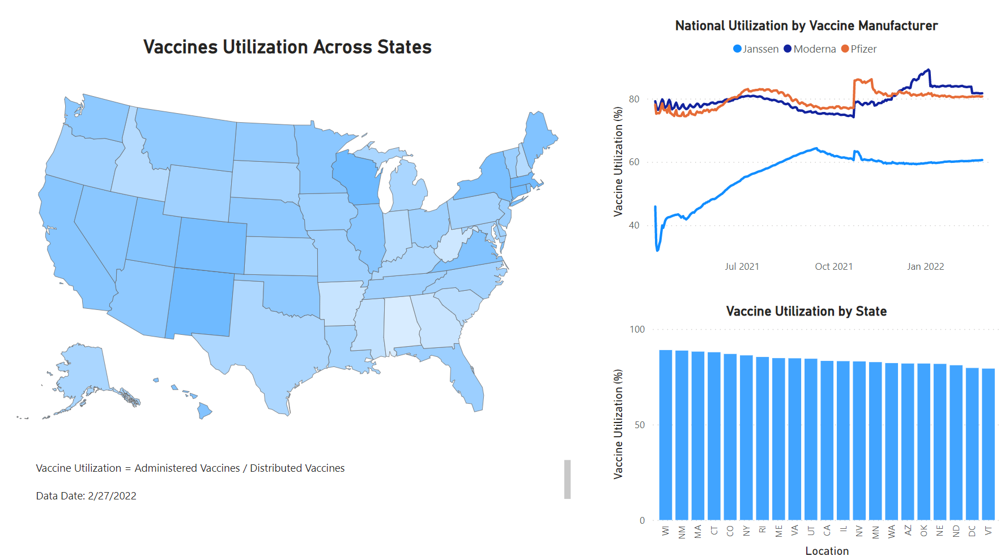

# Publishing COVID-19 Vaccination dataset to PowerBI via REST API

PowerBI allows for the creation of visualization dashboards that provide an extremely effective way to gain deeper business insights into certain trends. Being able to pull data from various data sources and automatically refresh dashboards regularly is extremely important for business reporting. In spite of the wealth of data available, not all data sources are easily accessible or in the appropriate format. 

In this script, we are analyzing the utilization of vaccines in the US based on data from the CDC. Firstly, the dataset COVID-19 vaccination dataset is downloaded from the CDC via their REST API. Secondly, the json data is used to create a new dataset using the create_dataset module which can be published to PowerBI. 

To construct a dataset into an appropriate format, Classes are created to represent Rows, Columns, Tables, and Datasets. 
- A tables is made up of Rows and Columns
- A Dataset is made up of Tables

COVID-19 Vaccination Dataset Link: https://data.cdc.gov/Vaccinations/COVID-19-Vaccinations-in-the-United-States-Jurisdi/unsk-b7fc

```
{
    'name': 'Vaccine_Distribution_Dataset', 
    'defaultMode': 'Push', 
    'tables': [
        {
            'name': 'Vaccine_Distribution_Table', 
            'columns': [
                {'name': 'date', 'dataType': 'datetime'},
                {'name': 'location', 'dataType': 'string'},
                {'name': 'distributed', 'dataType': 'Int64'},
                {'name': 'distributed_janssen', 'dataType': 'Int64'},
                {'name': 'distributed_moderna', 'dataType': 'Int64'},
                {'name': 'distributed_pfizer', 'dataType': 'Int64'},
                {'name': 'administered', 'dataType': 'Int64'},
                {'name': 'administered_janssen', 'dataType': 'Int64'},
                {'name': 'administered_moderna', 'dataType': 'Int64'},
                {'name': 'administered_pfizer', 'dataType': 'Int64'}
                ],
            'rows': [
                {'date': '2022-02-27T00:00:00.000', 'location': 'ME', 'distributed': '3187950', 'distributed_janssen': '151900', 'distributed_moderna': '1256020', 'distributed_pfizer': '1780030', 'administered': '2703032', 'administered_janssen': '142673', 'administered_moderna': '1100364', 'administered_pfizer': '1456688'},
                {'date': '2022-02-27T00:00:00.000', 'location': 'NY', 'distributed': '43882545', 'distributed_janssen': '1859300', 'distributed_moderna': '15446600', 'distributed_pfizer': '26576645', 'administered': '37842993', 'administered_janssen': '1416416', 'administered_moderna': '13681805', 'administered_pfizer': '22725229'}
                ]
        }
    ]
}

```

Pushing a dataset to PowerBI via REST API requires authentication in Microsoft Azure. I will not go into too much detail here.

Once published, the dataset can be used to create visualizations. Subsequent datasets that are pushed can be used to update the dashboard and visualizations automatically.



The PowerBI dashboard has been included in the sample.